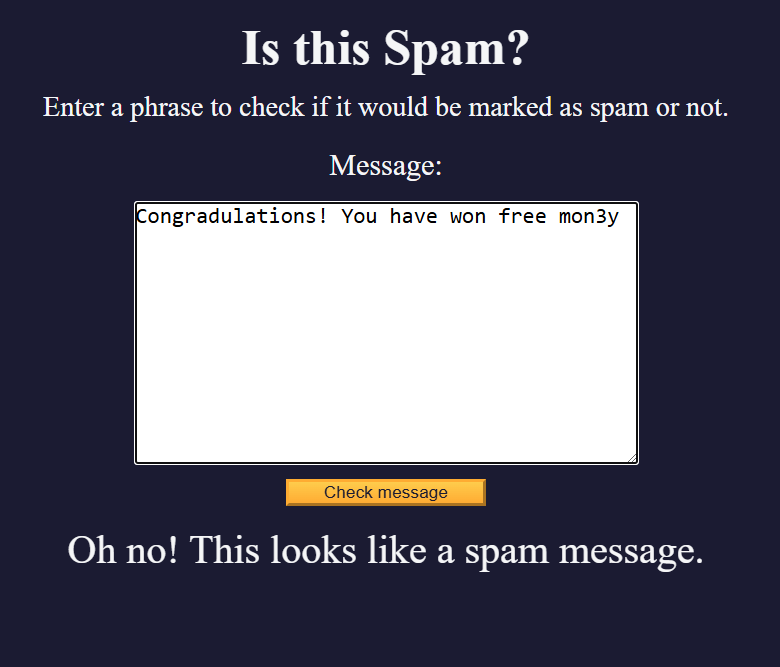

# Spam Filter

## Overview

This project is a simple spam filter built using JavaScript that identifies and categorizes spam messages based on specific keywords or patterns. The goal of this project is to detect spam messages and prevent unwanted content.

## Features

- Detects spam messages based on predefined patterns.
- Categorizes messages into spam and non-spam types.
- Simple and easy-to-understand code structure for learning and modification.

## Technologies Used

- **HTML**: For structuring the web interface.
- **CSS**: For styling the application.
- **JavaScript**: For the spam message detection logic.

## How It Works

The spam filter uses regular expressions to match common patterns found in spam messages. These patterns are then used to classify messages as spam or non-spam.

## Usage

1. Clone the repository or download the files.
2. Open the `index.html` file in a browser.
3. Enter a message and the system will classify it as either spam or non-spam.

## Example

For example, entering a message like "Congratulations! You've won a prize" will trigger the spam filter and categorize the message as spam.

## Screenshot

    

